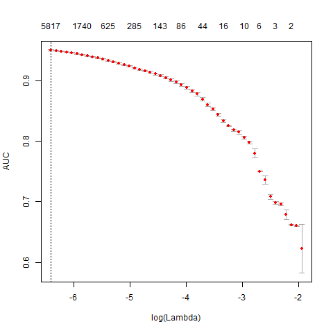
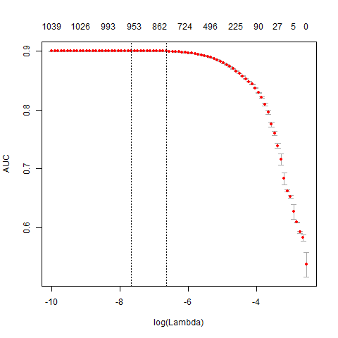
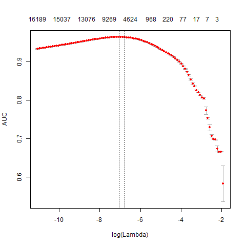
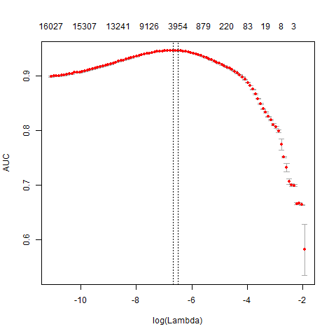

 The competition was held by Analytics Vidhya based on text Analytics.

Shakespeare probably saw a world expressing itself on Twitter before any one did! And he would have known if any one made a sarcastic tweet
or not. But for our machines and bots, they need help from data scientists to help them decipher sarcasm. 
Task for this competition is to build a machine learning model that, given a tweet, can classify it correctly as sarcastic or non-sarcastic.
This problem is one of the most interesting problems in Natural Language Processing and Text Mining.
You never know - the next generation of bots might come and thank you for making them smarter! 
The prediction has to be made using only the text of the tweet.

Training data contains three variables 
1. ID- ID for each tweet
2. tweet-  contains the text of the tweet
3. label- the label for the tweet (‘sarcastic’ or ‘non-sarcastic’)

Test data only has  two variables ID and tweet.
The data is large and thats why it is important to preprocess the data as to get the predictions
Train data contain 91298 rows and test data contain 39392

The first task is to convert the tweets into document term matrix.the first step is to vectorize text by creating a map from
words or n-grams to a vector space.The first step is to vectorize text by creating a map from words or n-grams to a vector space.
Constructing a DTM, even for a small collections of documents, can be a serious bottleneck "text2vec" solves the problem of making 
Document term matrix and it works faster than "tm" package.

Using text2vec package a vocabulary based Document Term Matrix is made.
The first document term matrix 91298 rows and 39855 columns. Here 39855 represents number of unique terms.
Using the glmnet package to fit a logistic regression model with an L1 penalty and 4 fold cross-validation which took 258 seconds and
give AUC of 0.9506.

      

The training time for the model is quite high. It can be reduced and also significantly improve accuracy by pruning the vocabulary. Using
only the words or terms which comes more frequently in the documents.
After pruning the new document term matrix contained 91298 rows and 1053 column and again fitting the logistic regression with L1 penalty on
new data give AUC of .9006 and the time taken is 311.62 seconds.

      

The auc is not improved by pruning the vocabulary and looks like the significant data is lost so using N grams.
Used 2-grams
After using 2-grams the new document term matrix contained 91298 rows and 18544 column and again fitting the logistic regression with L1 penalty on
new data give AUC of .9635 and the time taken is 114.83 seconds

      

At last in search of better accuracy applying feature hashing.
the new document term matrix contained 91298 rows and 16384 column and again fitting the logistic regression with L1 penalty on
new data give AUC of .9466 and the time taken is 119.06 seconds

      

Now using the third option of n grams(2) for predicting the test data as the auc was max among all in the n gram approach and the algorithm is
regularised so less chances of overfitting.
Leaderboard #31

